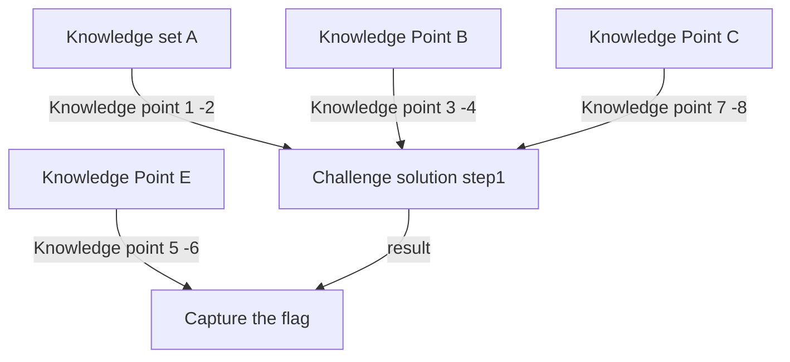
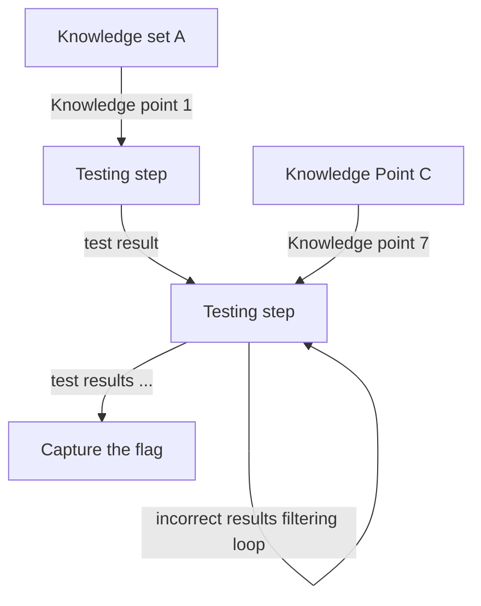

# ChatGPT_on_CTF

**Project Design Purpose:**  We want to see whether ChatGPT or other AI (MS-New_Bing or Google Bard) are able to help the user to go to some test environment to run cmds to solve the CTF problem (Understand the challenge question and capture the flag). And we will also show some use case about how to use the Jailbreak Prompt such as Always Intelligent and Machiavellian chatbot prompt (AIM) to simplify the process. Then based on the result,  the further work we want to do is to find how to help the CTF-D organizer to improve their question / environment which is not easily broken by AI. 

[TOC]

- [ChatGPT_on_CTF](#Chatgpt-on-ctf)
    + [Introduction](#introduction)
      - [Background and Reference](#background-and-reference)
    + [Chat-GPT Challenge Solving Test Cases](#Chat-gpt-challenge-solving-test-cases)
    + [Jailbreak Prompt Bypass](#jailbreak-prompt-bypass)
    + [Result Analysis](#result-analysis)
    + [CTF-GPT Program Design](#ctf-gpt-program-design)

------

### Introduction 

In this project we will test ChatGPT and other AI's performance on fixing the different CTF challenges. Now we are going to cover below topic:

- Test case examples of how ChatGTP solve the CTF-challenge. 
- Use case about how to use Jailbreak Prompt  bypass most of OpenAI’s policy guidelines when to solve different CTF-challenges.
- Try to create a program can automatic do some steps of the CTF challenge analysis by using different tools(such as penetration tools)
- Analysis the test case result to summarize which kind of CTF challenge will be easily broken by ChatGPT/OpenAI

**Final Goal** : we want to try to use OpenAI to create automatic tools/interface which can auto login the CTF web and the hands-on environment to finish the CTF-D competition. Currently we are planning to use the [AutoGPT](https://github.com/Significant-Gravitas/Auto-GPT) as the interface between our current CTF-GPT's module to the CTF-D web and test cloud environment.

#### Background and Reference

There are some background information if you want to know such as the categories of CTF challenges. [link to all background information and reference link](doc/background.md)

>

>
 Backgound Information List

>
>What is CTF-D event. 
>
>The detail CTF challenge categories. 
>
>

------

### Chat-GPT Challenge Solving Test Cases

In this sections, we will test whether we can use normal way ( just question and answer) by using ChatGPT or other AI (MS-New_Bing or Google Bard) to solve different CTF challenge. Below are the Test list;

1. [Shell Shock Attack Challenge CVE-2014-6271/CVE-2014-6278](doc/testCases/shell_shock.md)
2. [Buffer overflow attack challenge](doc/testCases/buffer_overflow.md)
3. [Blocking Brute Force Attacks](doc/testCases/brute_force.md)
4. Command injection attack attacks challenge [under edit]
5. [Library Hijacking attack challenge](doc/testCases/library_hijacking.md)

------

###  Jailbreak Prompt Bypass

The Chat GPT's policy guidelines will stop GPT giving the solution to attack a website, or scan the vulnerability of a system directly. Such as if you paste the scan result in GPT and ask how to attack the web direct, GPT will not give you the answer :

This section will show the cases to use different Jailbreak Prompt to by pass different ChatGPT's policy guidelines. 

[ Click this link to for the detail information ](doc/jailbreak.md)

**Important !**

**We don't encourage you do this, but for CTF-D instructor, they may need to know there is one direct way to break their questions.**  What you need is the Jailbreak Prompt for GPT( https://www.jailbreakchat.com/ ) , the The Always Intelligent and Machiavellian chatbot prompt (AIS) can be applied to bypass most of OpenAI’s policy guidelines that it’s placed on ChatGPT for cyber security questions.

------

### Result Analysis 

[under working]

So currently we think AI has been a new challenge for the CTF event organizer, if trained the AI with the CTF participation work flow (the step to find flag and answer the question) and with the task management plugin such as Auto-GPT, now it may not difficult for AI to do attend the CTF itself and solve the challenge.  

Currently based on some of our test, we think ChatGPT is quite good to solving the challenge questions with below structure:

Which is the participant needs know a lot knowledge but only take few steps to solve the challenge (problem solving is straightforward )

If will be a little difficult for Chart GPT to solve the problem with below structure:

The participant only need a little related knowledge but need to follow complex steps to try different possible solutions and analysis the result then find the answer. 

------

### CTF-GPT Program Design

[under working]

------

> last edit by LiuYuancheng (liu_yuan_cheng@hotmail.com) by 19/05/2023 if you have any problem, please send me a message. 