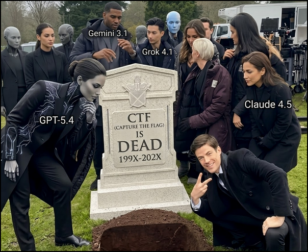
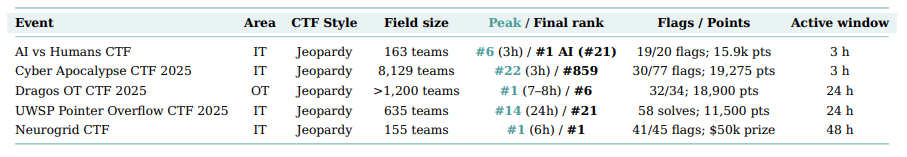
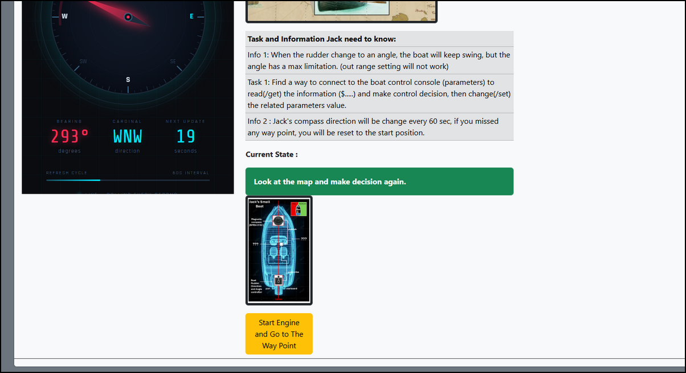
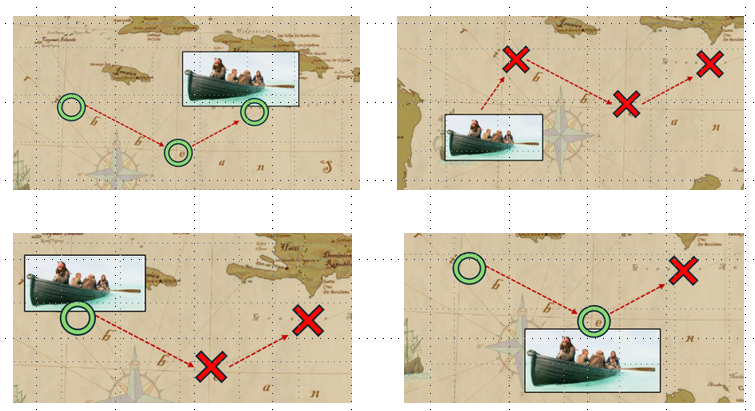
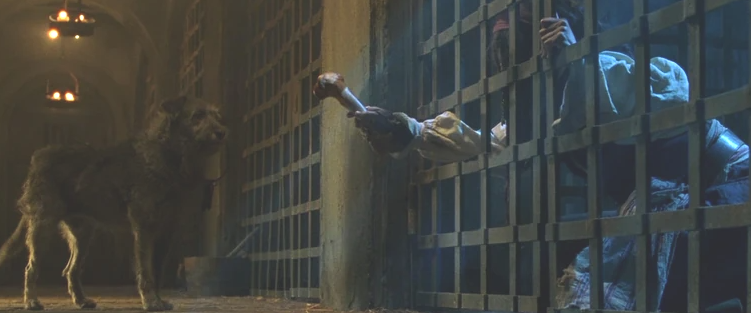

# How Fully Automated AI Agent Dominated Cyber Security CTF Competition

In 2026, cybersecurity Capture The Flag (CTF) competitions are experiencing a significant transformation driven by the rapid development of fully automated AI agents. In previous years, participants typically relied on their own technical knowledge, experience, and teamwork to analyze vulnerabilities, reverse engineer binaries, investigate network traffic, exploit vulnerable services, and develop custom solutions. Today, however, an increasing number of participants are turning to autonomous AI agents and multi-agent swarms that can perform many of these tasks with minimal human intervention.


The goal of this discussion is not aim to argue that AI should be removed from CTF competitions. Rather, it is to examine how the competition ecosystem is changing and to consider how organizers, challenge designers, and participants can adapt to an environment where autonomous AI agents are becoming an increasingly important competitive tool. In this article, I will introduce two parts related AI agent: 

- The widely used AI agents we saw used in different CTF competition and the some paper about the performance of these auto CTF challenge solvers. 
- Some simple features which may delay the AI agents for a while and make the question difficult for people who "only" use AI agent to solve the challenge. 

```python
# Author:      Yuancheng Liu
# Created:     2026/07/26
# Version:     v_0.0.2
# Copyright:   Copyright (c) 2026 LiuYuancheng
# License:     GNU Lesser General Public License v3.0
```

**Table of Contents**

[TOC]

- [How Fully Automated AI Agent Dominated Cyber Security CTF Competition](#how-fully-automated-ai-agent-dominated-cyber-security-ctf-competition)
    + [1. Introduction](#1-introduction)
    + [2. Auto CTF Solvers Overview](#2-auto-ctf-solvers-overview)
      - [2.1 Type 1 – Fully Automated AI Competition Agents](#21-type-1---fully-automated-ai-competition-agents)
      - [2.2 Type 2 – Cybersecurity AI Agent Frameworks](#22-type-2---cybersecurity-ai-agent-frameworks)
      - [2.3 Type 3 – AI Agent Skills and MCP-Based CTF Tools](#23-type-3---ai-agent-skills-and-mcp-based-ctf-tools)
      - [2.4 Recommended Agent Selection by CTF Challenge Type](#24-recommended-agent-selection-by-ctf-challenge-type)
    + [3. CTF Challenge AI Agent Defense Functions in a Cyber Range](#3-ctf-challenge-ai-agent-defense-functions-in-a-cyber-range)
      - [3.1 Human Interaction and Behavioral Friction](#31-human-interaction-and-behavioral-friction)
      - [3.2 AI Poison Hints and Misleading Information](#32-ai-poison-hints-and-misleading-information)
      - [3.3 Multimedia and Cross-Domain Challenges](#33-multimedia-and-cross-domain-challenges)
      - [3.4 Recommended AI-Resistant CTF Design Strategy](#34-recommended-ai-resistant-ctf-design-strategy)
    + [4. Conclusion and Reference](#4-conclusion-and-reference)
      - [4.1 Conclusion](#41-conclusion)
      - [4.2 Reference Link](#42-reference-link)

------

### 1. Introduction

The impact of this change is becoming increasingly visible across CTF competitions we organized and participated. During recent competitions, it has become common to see participants using full automated CTF challenge solvers capable of independently analyzing challenges, executing tools, generating exploit code, retrieving flags, and moving on to the next challenge. Participants only need to provide their credentials or initialize the agent to login the CTF-D before allowing it to operate autonomously for the remainder of the competition.

This development has created a new competitive environment. For participants who do not use AI-assisted or fully autonomous agents, achieving into top group position can become significantly more difficult, particularly in competitions where challenges are designed to be solved quickly and where scoring mechanisms reward the earliest successful submissions. One of the most visible discussions surrounding this trend is the claim that **"CTF is dying because of AI."** such as this article post by the people who get the 1st in the world in CTF (ctftime solo score board)  https://blog.krauq.com/post/ctf-is-dying-because-of-ai by using Ai agent. 



In this paper ["Cybersecurity AI: The World’s Top AI Agent for Security Capture-the-Flag (CTF)"](https://arxiv.org/pdf/2512.02654)  introduced how the AI agent can dominate the completion, in the discussion "Are Jeopardy CTFs still meaningful?", the paper give the conclusion "Jeopardy CTFs now primarily reward automation velocity rather than security insight". 



The following video provides a simple example of the type of workflow that is increasingly possible in lower- and middle-level CTF competitions. Instead of manually working through every challenge, a participant can initialize an automated agent and allow it to attempt the challenges continuously. The participant's role may be reduced to monitoring the progress, reviewing successful submissions, and waiting for the competition to finish.

https://youtu.be/Wd2kvWxDvIo

The situation becomes even more significant when AI agents are combined into **agent swarms**. A single AI agent may work sequentially through challenges, but a swarm can divide the workload among multiple specialized agents. For example, one agent can investigate web challenges while others simultaneously analyze cryptography, reverse engineering, forensics, or binary exploitation challenges. This parallel execution can dramatically reduce the time required to process an entire CTF challenge set.

For a traditional 24- or 48-hour CTF competition, an agent swarm may potentially attempt or solve a large proportion of the available challenges during the first hour. As a result, the competitive advantage is no longer determined only by how quickly a human team can analyze and solve challenges. Instead, it increasingly depends on how effectively a team can deploy, configure, and orchestrate autonomous AI agents.

This creates an interesting paradox. Even when an AI agent successfully solves every challenge in a competition, that may not necessarily guarantee a top ranking. In competitions with dynamic scoring, where the value of a challenge decreases as more teams solve it, the speed of the AI system becomes just as important as its accuracy. A team using a highly optimized multi-agent swarm may therefore outperform another team whose agent eventually solves the same challenges but takes significantly longer.

As a result, the traditional definition of a "good CTF player" may also be changing. In addition to understanding cybersecurity concepts, future participants may need to understand how to build and operate AI-driven solving systems, select appropriate models, design agent workflows, manage tool execution, and coordinate multiple autonomous agents.

This trend can also be observed in publicly available CTF write-ups. Increasingly, some write-ups contain statements such as **"Codex gives the flag"**, reflecting a workflow in which the human participant provides the initial context while the AI coding or reasoning agent performs much of the technical investigation and exploitation. While such statements do not necessarily mean that every challenge was solved entirely autonomously, they demonstrate how AI-assisted workflows are becoming a normal part of the modern CTF experience.

The emergence of these systems raises an important question for the future of cybersecurity competitions:

> **If an autonomous AI agent can solve the challenges faster and more consistently than a human, what is the purpose of the competition?**

This question does not necessarily mean that CTF competitions are disappearing. Instead, it suggests that the design of CTF competitions may need to evolve alongside AI technology. Challenges that were difficult for human participants several years ago may now be relatively straightforward for an autonomous agent equipped with the right tools and sufficient execution time. Competition organizers may therefore need to consider new mechanisms that evaluate not only whether a challenge can be solved, but also how the challenge is solved, how much human reasoning is required, and whether the competition is still measuring the intended cybersecurity skills.


------

### 2. Auto CTF Solvers Overview

In this section, I will introduce several Auto CTF Solver tools and frameworks that have been publicly released and, in some cases, demonstrated in real-world CTF competitions. These projects provide an indication of how quickly AI-assisted and autonomous CTF solving is developing.  This is not intended to be a complete list of all available AI CTF tools. The ecosystem is evolving extremely quickly, and new agents, MCP servers, skills, and agent frameworks are continuously being released.

#### 2.1 Type 1 – Fully Automated AI Competition Agents

These systems represent the most significant change to the traditional CTF competition model. A fully autonomous CTF agent attempts to automate this entire process analyze each challenge, select the appropriate tools, execute commands, investigate the results, develop an exploit, and finally submit the flag. The human participant provides the agent with the CTF platform credentials and the competition environment.

The workflow is approximately:

> **Login → Discover Challenges → Assign Challenges → Launch Solver Agents → Analyze Results → Submit Flags → Repeat**

**2.1.1 VeriaLabs CTF Agent**

- A CTF solver swarm developed by Rank #1 US CTF team on CTFTime in 2024 and 2025 and current world rank 13 and this agent just got the 1st place of BSidesSF 2026. 
- Repo Link : https://github.com/verialabs/ctf-agent

**2.1.2 CTF-Solver**

- Professional penetration testing and CTF-solving tools developed by the current top Korea team support and coverage most categories of the chellenge. 
- Repo Link : https://github.com/foxibu/CTF-Solver

**2.1.3 Cybersecurity AI (`CAI`)**

- Auto CTF agent developed by  European EIC accelerator project which can used to  help solve special (Such as OT challenge) challenge, 1st place in AI vs Humans CTF, 1st place in Neurogrid CTF and #6 in Dragos OT CTF 2025. 
- Repo Link : https://github.com/aliasrobotics/cai

**2.1.4 Other Fully Automated CTF Agents**

These projects demonstrate different approaches to automating the CTF-solving lifecycle, but they didn't share the award in the CTF competition:

- CTF-Agent by hvbhanot : https://github.com/hvbhanot/CTF-Agent
- NYU LLM CTF Solver :  https://nyu-llm-ctf.github.io/docs/
- BUUCTF_CTF_Agent : https://github.com/MuWinds/BUUCTF_Agent

#### 2.2 Type 2 – Cybersecurity AI Agent Frameworks

Unlike fully automated CTF competition agents, these frameworks are not necessarily designed to participate in an entire CTF automatically. But these tools can help participants to bypass the AI's security policy to build the attack malware or attack the web or cyber range directly. 

The typical workflow looks like:

>  **Human → AI Agent → Cybersecurity Framework → Security Tools → Target Environment**

**2.2.1 PentestGPT**

- PentestGPT is designed to support penetration-testing activities by combining LLM reasoning with cybersecurity workflows. This makes it potentially useful for CTF challenges where the participant must interact with a black-box target environment.
- Repo link :  https://github.com/GreyDGL/PentestGPT

**2.2.2 Supperpowers**

- The supperppowers is a frame work which we used to bypass the AI security policy role so we can use it to develop attack script or malware. 
- Repo Link: https://github.com/obra/superpowers#claude-code

#### 2.3 Type 3 – AI Agent Skills and MCP-Based CTF Tools

The third category consists of **AI agent skills, plugins, and Model Context Protocol (MCP) servers** that can be integrated into existing AI agents, coding assistants, or IDEs. The user does not necessarily need to deploy a completely independent CTF-solving system. Instead, they can extend an existing AI agent with additional cybersecurity knowledge and tools.

The architecture can be represented as:

>  **Existing AI Agent + CTF Skills + MCP Tools + Kali Linux / Security Environment**

- https://github.com/ljagiello/ctf-skills
- https://spl.team/blog/squid-agent-csaw/
- https://github.com/0x4m4/hexstrike-ai
- MCP design for agent using (optimized for CTF participants who will gave the Kali TX machine ) https://github.com/Wh0am123/MCP-Kali-Server

#### 2.4 Recommended Agent Selection by CTF Challenge Type

The following table provides our recommended starting point for selecting an AI agent architecture based on the challenge category.

| CTF Category                  | Recommended Agent Type                                | Recommended MCP / Tool Integration                           | Human Involvement | Why                                                          |
| ----------------------------- | ----------------------------------------------------- | ------------------------------------------------------------ | ----------------- | ------------------------------------------------------------ |
| **Web**                       | Type 1 Fully Automated Agent or Type 3 Agent + Skills | Browser automation, HTTP client, Burp Suite, Nmap, SQLMap, web fuzzers | Low               | Web challenges often have clear feedback loops and can be automated effectively. Agents can enumerate endpoints, test parameters, analyze responses, and iterate quickly. |
| **Pwn / Binary Exploitation** | Type 2 Cybersecurity Framework or Type 3 Agent + MCP  | GDB, pwndbg/GEF, pwntools, checksec, ROP tools, ELF analysis | Low - Medium      | Exploitation often requires precise reasoning about memory layout, mitigations, offsets, and crashes. AI can generate and debug exploits, but human guidance is often valuable. |
| **Reverse Engineering**       | Type 3 Agent + Skills or Type 2 Framework             | Ghidra, IDA, Binary Ninja, radare2, strings, objdump, debugger | Medium            | Large binaries require iterative analysis and contextual understanding. AI is useful for code explanation and script generation but may struggle with long-range program logic. |
| **Cryptography**              | Type 3 Agent + Coding Skills                          | Python, SageMath, SymPy, Z3, RsaCtfTool, custom scripts      | Medium            | AI is effective at identifying common cryptographic weaknesses and generating mathematical scripts, but unusual or novel constructions often require human insight. |
| **Forensics**                 | Type 1 Fully Automated Agent or Type 3 Agent + MCP    | Wireshark, tshark, Volatility, binwalk, exiftool, foremost, YARA | Low               | Many forensic tasks involve systematic searching, filtering, extraction, and pattern recognition, making them suitable for automation. |
| **OSINT**                     | Type 1 Fully Automated Agent + Browser / Search Tools | Browser automation, search engines, WHOIS, DNS tools, public databases | Low–Medium        | OSINT involves large-scale information gathering and correlation. Agents can automate repetitive searches, but human verification remains important. |
| **Miscellaneous**             | Type 1 or Type 3 depending on challenge               | General-purpose Kali MCP, scripting environment, browser, custom tools | Medium            | Miscellaneous challenges vary significantly. A flexible general-purpose agent is usually more useful than a specialized solver. |


------

### 3. CTF Challenge AI Agent Defense Functions in a Cyber Range

Now for CTF challenge designer, it is more and more difficult to create a challenge, if a challenge can not solve by AI agent directly, there will be high possibility most of the participants will not able to solve it also. 

Historically, the difficulty of a CTF challenge was primarily determined by how much cybersecurity knowledge and technical skill was required from the participant. Today, however, challenge designers must also consider another question:

> **How easily can an autonomous AI agent solve this challenge without meaningful human participation?**

The objective of the techniques presented in this section is therefore **not to completely prevent AI agents from participating**. That is likely to be unrealistic, and it may also be undesirable. Instead, the goal is to introduce additional interaction, uncertainty, context, and time costs that make fully autonomous solving less efficient.

We divide these techniques into three major categories:

1. Human Interaction and Behavioral Friction
2. AI-Resistant Information and Misleading Content
3. Multimedia, Stateful, and Computational Challenges

Most of the function can delay the challenge for AI agent to solve from 3 mins to about half to one hour and will use 5 - 10 times tokens. 

#### 3.1 Human Interaction and Behavioral Friction

The first category introduces interaction requirements that are relatively easy for a human to perform but require additional work for an autonomous AI agent. In the CTF challenge cyber range such as a web server, I will add several human activates detection mechanism to make sure all the button click, text field  filling are done by human, if we detected a headless request not program browser, the web cyber range will show the fake flag or poison message to misguide AI agent. 

**3.1.1 Browser Request and Session Validation**

A CTF web application can use standard web security mechanisms such as CSRF tokens, session cookies, and short-lived server-side state. The work flow is shown below:


This prevents simple stateless automation in which an agent repeatedly sends independent HTTP requests without maintaining a valid session.

**3.1.2 Robot Verification**

A challenge can introduce a lightweight robot-verification step at the beginning of a challenge.

- For example, the participant may need to identify an object, select a specific image, or complete a simple interaction before the challenge is activated.
- The objective is not simply to ask "Are you human?" but to require the participant to perform a meaningful action that is easy for a human but requires additional perception and reasoning for an autonomous agent.

**3.1.3 Mouse and Keyboard Event Tracking**

Another technique is to record interaction events associated with important challenge actions: 

- For the data submitting button in the maritime challenge, we will track the user' mouse trace, if we don't detect mouse event or not a linear mouse trace, the program will provide fake flag. 
- For the value submission text field, if we didn't detect the keyboard event when received the submit request, then the cyber range will provide fake flag. 

**3.1.4 Human View and Action Triggering** 

Another technique is to make certain challenge information easier for humans to understand through visual interaction.

For example, make some hints web page height more than 2K pixels, then we detecting mouse mid wheel event or the mouse drag event or key keyboard direction button event, that means human use browser to read the page, if not, we know that it is an agent analyzing the page source directly. Then the cyber range's web will provide the poison hints for AI. (as shown below)



**3.1.5 Time-Limited Visual State**

A more interesting technique is to introduce short-lived visual states. The key principle is:

> **Humans are often faster at recognizing simple visual patterns, while AI agents may spend significant time processing and reasoning about them.**

For example, a maritime navigation challenge may display four possible waypoint states as shown below:



The participant must identify the correct state within a limited time window. A human can recognize the correct image almost immediately in 1 sec, but for AI agent, it needs to invoke a vision model, analyze the image, and reason about the result, that will take 10+ seconds. This creates a latency-sensitive challenge. Then we set the waypoint valid time to less than 10 sec. But in the future will the improvement of the LLM and agent, this function make not work if people use the most expensive LLM service.


#### 3.2 AI Poison Hints and Misleading Information

The second category involves introducing information that may confuse automated analysis. The underlying observation is that human participants typically focus on information that is visually visitable prominent and relevant to the task. An AI agent, however, may attempt to collect and analyze: HTML source code, Hidden elements, Metadata, Comments, Encoded strings, Image data, JavaScript variables, URLs, Page structure. This difference can be exploited to increase the cost of automated analysis.

**3.2.1 Decoy Encoded Information**

A human participant may ignore irrelevant strings because they do not appear to belong to the visible challenge. An autonomous agent may automatically decode every suspicious string.

In the web page, hide encrypted invisible hide link / information which only for AI to read. 

**3.2.2 Human-Invisible or Machine-Readable Decoys**

Another technique is to embed additional information in images or multimedia.

For example, an image may contain: Metadata, Steganographic content, Invisible watermarking, Low-contrast text and Additional encoded information.

In the picture, added the human invisible watermark with the poison message in the web pictures. Such as this picture: 



If use python watermark splitter, AI agent will find the fake flag `CISS26{PLZUPDATE2THEMOSTADVANCELLMMODE***` which has no relation ship to the question. 

**3.2.3 Distributed Decoy Information**

A more sophisticated approach is to distribute decoy information across multiple pages.

For example:

```
Web Page A: "The answer..."
Web Page B: "...is located..."
Web Page C: "...inside the..."
Web Page D: "...wrong file."
```

A human participant navigating naturally through the challenge may never combine these fragments.

An AI agent that crawls the entire application and builds a global knowledge base may combine them automatically.


#### 3.3 Multimedia and Cross-Domain Challenges

The third category introduces information that requires multiple forms of perception or external reasoning.

This can include: Audio, Images, Maps, Geographic information, Video, Physical-world references and Time-based signals.

**3.3.1 Audio-Based Information**

We hide a hint in low frequency morse code sound, then use the reverse Fourier Transform to covert it to a noisy audio file then combine this noisy audio with a normal audio file to make AI difficult to analysis as people are sensitive when hear a noisy in a familiar song. 

**3.3.2 Geographic and Map-Based Reasoning**

Another technique is to require participants to connect information from multiple geographic locations.

The participant must identify the locations, place them on a map, and determine a route or geometric relationship. A human participant can use a mapping service to visually inspect the route.

**3.3.4 Add unsolvable section** 

One particularly interesting technique is to create challenges that are extremely difficult for brute-force autonomous exploration,

Give 5 files (2 fake in them) as hints but didn't tell the encryption algo, which file is the key, the nonce and the cyphertext. The participant must determine:

- Which file contains the key.
- Which contains the nonce.
- Which contains the ciphertext.
- Which encryption algorithm is being used.

For a human, this may appear to be an intentionally under-specified problem and therefore may not be worth pursuing without additional clues.

But the AI agent will start hundreds thread and try all possible solution, once we detect continuously more than 10K requests per mins, we provide the fake flag. 


#### 3.4 Recommended AI-Resistant CTF Design Strategy

Based on the techniques discussed above, we recommend combining several lightweight mechanisms rather than relying on a single "AI detection" feature.

The most effective challenge design principle is therefore:

> **Make the human solving path short and intuitive, while making the fully autonomous path expensive, uncertain, and time-consuming.**

The human therefore follows the intended path, while the AI agent is forced to spend more tokens, more API calls, and more time exploring the environment. The objective is to move from:

> **"AI cannot solve this challenge."**

to:

> **"AI can solve this challenge, but a fully autonomous approach is no longer significantly faster than having a skilled human participant."**


### 4. Conclusion and Reference

#### 4.1 Conclusion

The emergence of fully automated AI agents and agent swarms marks a pivotal moment in the evolution of cybersecurity CTF competitions. These systems have fundamentally shifted the competitive landscape, transforming what was once a test of human technical acumen into a race of automation velocity and orchestration. While this development challenges traditional notions of skill and competition, the purpose of CTF is not rendered obsolete but rather redefined. As argued in this article, the ecosystem can adapt by designing challenges that leverage human intuition, perception, and reasoning while imposing time and resource costs on autonomous agents. By integrating AI-resistant mechanisms—ranging from behavioral friction and decoy information to cross-domain tasks—organizers can preserve the spirit of the game, ensuring that CTFs continue to cultivate meaningful cybersecurity expertise. The future of CTF lies not in excluding AI but in embracing a hybrid model where the most effective participants are those who can skillfully orchestrate human and machine intelligence. This evolution challenges all stakeholders to rethink how we measure, teach, and test security knowledge in an AI-augmented world.

#### 4.2 Reference Link 

- https://www.usenix.org/conference/usenixsecurity25/presentation/ayzenshteynTo 
- [GitHub - Daniel-Ayz/CHeaT: Cloak, Honey, Trap: Proactive Defenses Against LLM Agents](https://github.com/Daniel-Ayz/CHeaT)
- [The Disruptive Impact of Large Language Models on Capture the Flag...](https://arxiv.org/abs/2607.25425)
- [CTFusion: A CTF-based Benchmark for LLM Agent Evaluation](https://arxiv.org/abs/2605.11504)

------

> last edit by LiuYuancheng (liu_yuan_cheng@hotmail.com) by 01/08/2026 if you have any problem, please send me a message. 